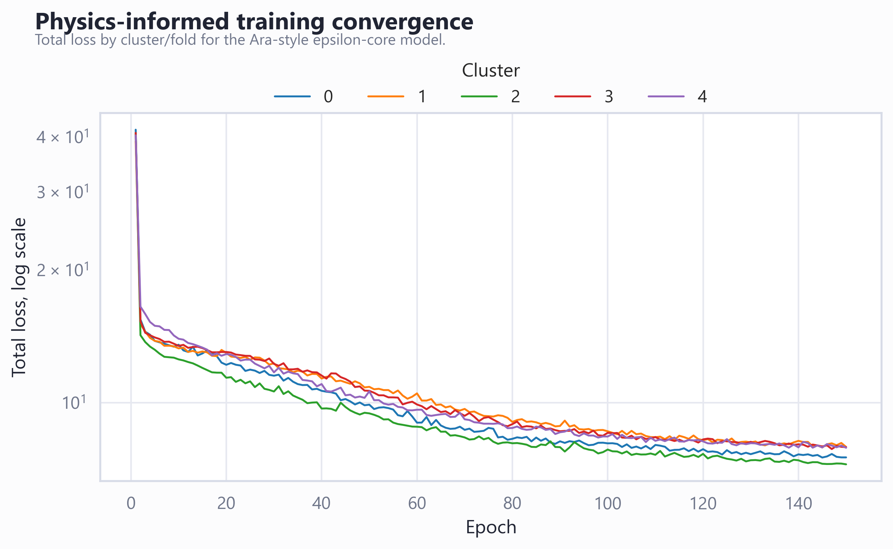
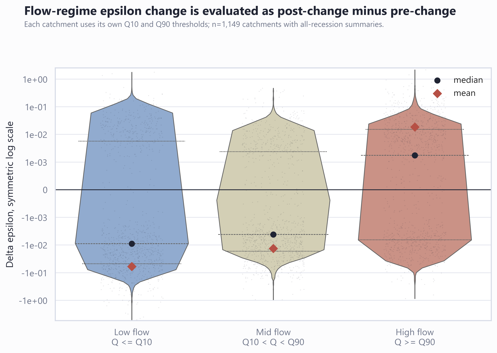
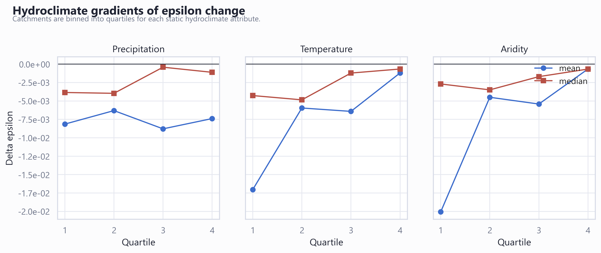
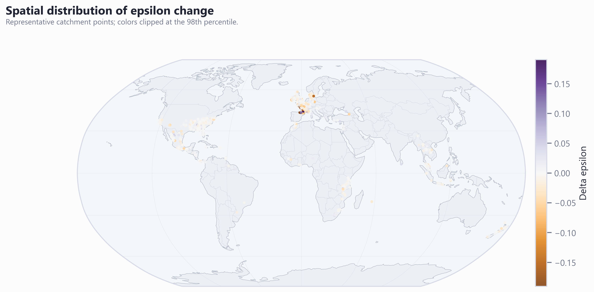

# Catchment Epsilon Change Around 1990

## Introduction

This study asks whether catchment recession behavior changed across the 1990 transition. We use `epsilon` as a daily latent coefficient in a physics-informed recession equation, inferred directly by the model for each recession day.

The analysis is organized around two periods:

```text
pre-change:  1950-01-01 to 1990-12-31
post-change: 1991-01-01 to 2019-12-31
```

The main scientific question is:

```text
Did catchment epsilon shift between 1950-1990 and 1991-2019, and is that shift structured by flow regime and hydroclimate?
```

## Resources

The current analysis uses:

```text
ERA5-Land catchment daily forcing and state variables
Event_Typology observed streamflow
catchment static attributes
LP/gamma AET prior bounds
Ara-style physics-informed epsilon-core LSTM
```

The model-ready daily series are stored as yearly parquet files under:

```text
_private/processed/epsilon_physics_daily_era5land_legacy_qobs_parquet/
```

Each record contains:

```text
GCIN, date, precipitation_mmd, temperature_C, pet_mmd, SM_%,
streamflow_mmd, observed_AET_mm
```

## Current Run

The production run is:

```text
run label: full_crossfit_era5land_legacy_1950_2019
cluster/fold count: 5
batch_size: 256
epochs: 150
```

The training follows Ara's `LSTM-epsilon` model structure. It trains one model per catchment cluster, then infers daily recession epsilon for the same cluster. The five cluster outputs are aggregated after all runs finish.

Cold-temperature filtering is enabled:

```text
remove recession days with daily mean temperature <= 0 deg C
```

The cold-temperature filter threshold is `0.0 deg C`; this removes recession days where the daily mean temperature is at or below the threshold.

## Results

The final cross-fitted analysis covers `1,149` catchments and `5,012,615` recession-day simulations.

### Model Skill



The model was trained separately for five catchment clusters and evaluated on recession-day streamflow. Model skill is summarized by catchment-level NSE/KGE first, then by the median across basins, so large high-flow basins do not dominate the diagnostic.

```text
median catchment NSE: -0.005
median catchment KGE: 0.094
pooled NSE, supplementary: 0.301
pooled KGE, supplementary: 0.449
```

The catchment-median NSE is close to zero, while the pooled NSE is higher because all recession-day records are stacked before scoring. This gap indicates that the inferred epsilon contrast is more stable as a cross-fitted recession-parameter analysis than as a basin-by-basin streamflow simulator.

### Epsilon Shift



For each catchment, epsilon change is defined as the post-change mean minus the pre-change mean:

```text
delta epsilon = mean epsilon in 1991-2019 - mean epsilon in 1950-1990
```

Across all recession days:

```text
mean delta epsilon: -7.658e-03
median delta epsilon: -1.916e-03
catchment share with negative delta epsilon: 60.5%
```

The all-catchment mean is negative and the median shift is also slightly negative. The absolute median is small, so the central tendency is a weak downward shift rather than a large regime-wide displacement. The distribution remains heterogeneous: `60.5%` of valid catchments show negative epsilon change, while a smaller set of catchments has positive shifts.

Flow-regime summaries use basin-specific observed-flow thresholds:

```text
low-flow epsilon:  recession days with observed Q <= each catchment's Q10
high-flow epsilon: recession days with observed Q >= each catchment's Q90
mid-flow epsilon:  Q10 < observed Q < Q90
```

- `low` flow: mean delta epsilon = -5.936e-02; median delta epsilon = -8.941e-03; mean relative delta = -4.4%.
- `mid` flow: mean delta epsilon = -1.322e-02; median delta epsilon = -4.148e-03; mean relative delta = -3.0%.
- `high` flow: mean delta epsilon = 1.856e-02; median delta epsilon = 1.743e-03; mean relative delta = 6.4%.

Low-flow and high-flow epsilon are evaluated separately because recession behavior under the tails of the flow distribution can reflect different storage-release controls. Their mean relative changes are `-4.4%` for low flow and `6.4%` for high flow. These flow-regime summaries should be read together with the median and quartile structure in the table, because outlier basins can move the mean.

### Hydroclimate Structure



The hydroclimate-gradient figure bins catchments into quartiles of precipitation, temperature, and aridity, then compares mean and median epsilon change within each bin. This checks whether the epsilon shift is a spatially random artifact or whether it aligns with background catchment climate.

The current result should be read as a first-order gradient analysis rather than a causal attribution test. The median changes remain close to zero compared with the mean changes, so the hydroclimate signal is likely influenced by a subset of catchments with large positive or negative deltas. The next statistical step is to test these gradients with robust regression or hierarchical models rather than relying on quartile plots alone.

### Spatial Pattern



The spatial map shows catchment-level epsilon change as point locations. It is designed to reveal regional clustering that is hidden in the histogram and boxplot. Blue and red points mark opposite signs of epsilon change, so the map should be interpreted together with the catchment-level delta table:

```text
catchment-level table: assets/epsilon_era5land_legacy_1950_2019/epsilon_change_by_catchment.csv
flow-regime table:    assets/epsilon_era5land_legacy_1950_2019/epsilon_change_by_flow_regime.csv
```

The map highlights heterogeneous post-1990 changes: the median change is small and negative, about `-1.916e-03`.

## Method Summary

For each catchment, the model reads a 365-day context window of dynamic inputs plus static attributes. It predicts daily `epsilon_t`, `q_base_t`, and bounded AET parameters `alpha`, `LP`, and `gamma`. AET is computed inside the model from PET, soil moisture, LP, and gamma. Streamflow is then solved through the closed-form state-reset recession equation and supervised against observed streamflow on recession days.

The main differential equation is:

```text
dQ/dt = -epsilon * Q^2 - epsilon * alpha * AET * Q
```

The model is therefore an epsilon-core physics-informed LSTM that infers daily epsilon directly inside the recession equation.
