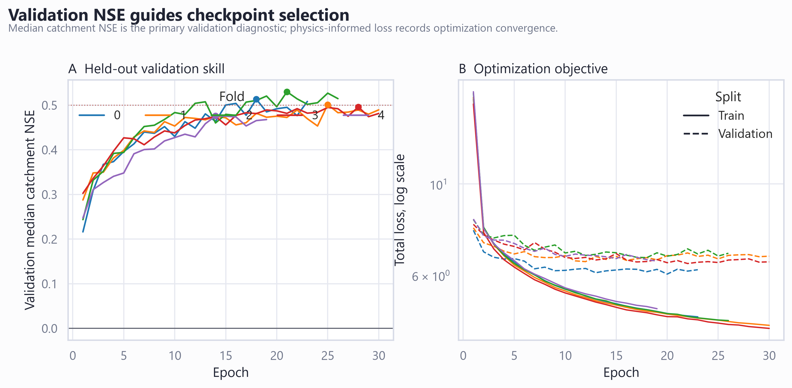
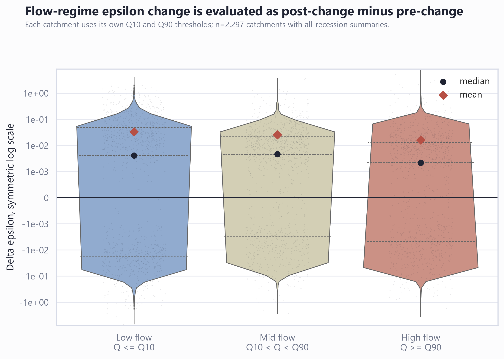
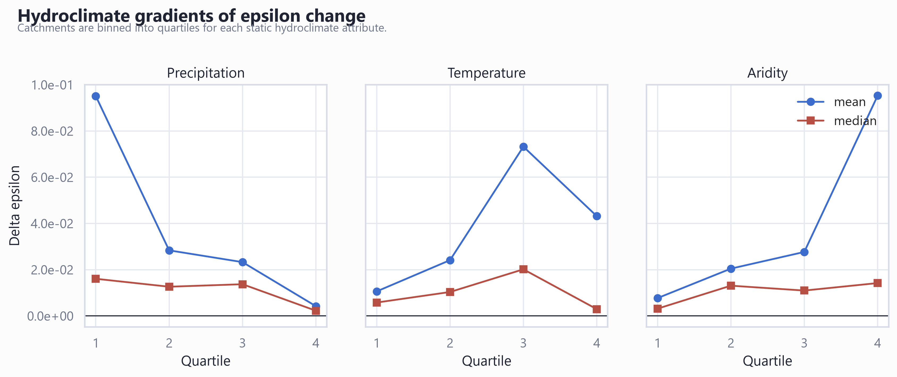
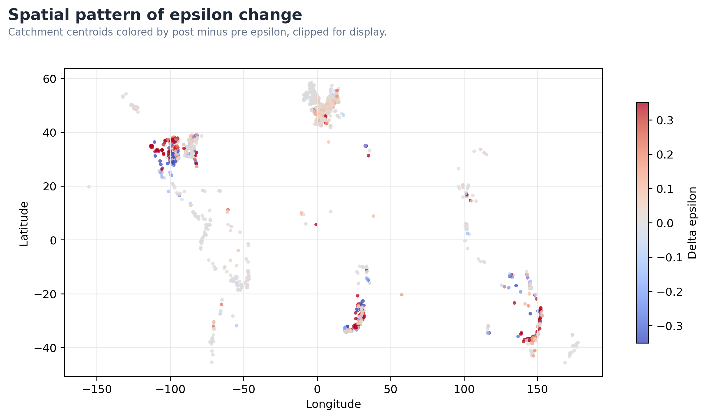

# Catchment Epsilon Change Around 1990

## Introduction

This study asks whether catchment recession behavior changed across the 1990 transition. We use `epsilon` as a daily latent coefficient in a physics-informed recession equation, inferred directly by the model for each recession day.

The analysis is organized around two periods:

```text
pre-change:  1950-01-01 to 1990-12-31
post-change: 1991-01-01 to 2019-12-31
```

The main scientific question is:

```text
Did catchment epsilon shift between 1950-1990 and 1991-2019, and is that shift structured by flow regime and hydroclimate?
```

## Resources

The current analysis uses:

```text
ERA5-Land catchment daily forcing and state variables
Event_Typology observed streamflow
catchment static attributes
LP/gamma AET prior bounds
Ara-style physics-informed epsilon-core LSTM
```

The model-ready daily series are stored as yearly parquet files under:

```text
_private/processed/epsilon_physics_daily_pure_gcin_1950_2019_parquet/
```

Each record contains:

```text
GCIN, date, precipitation_mmd, temperature_C, pet_mmd,
SM_%, streamflow_mmd, observed_AET_mm
```

Observed-Q duration is based on valid daily values rather than nominal table bounds:

```text
median valid Q record:                         16,132 days
median valid Q days in 1950-1990:             7,472
median valid Q days in 1991-2019:             9,204
catchments with any valid Q in both periods:   2,304
catchments with >= 2 years in both periods:    2,220
catchments with >= 5 years in both periods:    2,133
```

In the current pure GCIN run, `GCIN` is the original GCIN catchment identifier. Legacy/GridCode/Catchment_ID mixed products are excluded from production analysis because their numeric identifiers cannot be assumed to reference the same catchment boundaries.

## Current Run

The production run is:

```text
run label: temporal_crossfit_1990
cluster/fold count: 5
batch_size: 512
maximum epochs: 30
time roles per outer fold: 80% train / 20% test; no validation set
```

The model and physics-informed objective follow the reference `LSTM-epsilon` structure. The pre and post periods are each divided into five contiguous calendar blocks. In fold `k`, pre block `k` and post block `k` are held out together, while the other four pre blocks and four post blocks train one shared model. All catchments participate in every fold, but no test date can enter a training target, training context window, or normalization estimate.

There is no validation split and no checkpoint selection from NSE. Architecture, physics-loss weights, learning rate, and epoch count are fixed before testing; every fold retains its epoch-30 model. The Q-derived `low_high_ratio` static attribute is recomputed from training years only in each fold.

Across five rotations, every eligible date receives one out-of-fold prediction from a model that did not train on its temporal block. The resulting out-of-fold records are concatenated before calculating each catchment's pre-period NSE, post-period NSE, and epsilon contrast. Fold-level NSE means and dispersion are retained only as stability diagnostics.

Cold-temperature filtering is enabled:

```text
remove recession days with daily mean temperature <= 0 deg C
```

The cold-temperature filter threshold is `0.0 deg C`; this removes recession days where the daily mean temperature is at or below the threshold.

## Results

The final cross-fitted analysis covers `2,297` catchments and `9,192,715` recession-day simulations.

### Model Skill



The model is evaluated only on out-of-fold recession days. Inference uses the same 365-day warm-up plus 365-day target-window geometry used during training. Catchment-level NSE is an indirect reliability metric for latent epsilon, not a tuning target. Scores are summarized by the median across basins so large or long-record basins do not dominate the diagnostic; KGE is retained as a supplementary robustness metric.

```text
median catchment NSE: 0.581
catchment NSE p10-p90: 0.128 to 0.775
median catchment KGE: 0.642
catchment KGE p10-p90: 0.152 to 0.837
pre-period median NSE / KGE: 0.555 / 0.622
post-period median NSE / KGE: 0.626 / 0.666
pooled NSE, supplementary: 0.577
pooled KGE, supplementary: 0.586
```

For each catchment and period, the primary NSE is calculated once after concatenating all five folds' out-of-fold predictions. It is not the arithmetic mean of five fold NSE values, because each block has a different observed-flow variance. Fold NSE averages remain supplementary diagnostics.

The public explorer retains all evaluated catchments in its JSON. Its Overview panel applies the reliability filter in the browser: users can switch between NSE and KGE and change the threshold. At the default threshold of 0.5, `1,304` catchments pass NSE in both periods and `1,447` pass KGE in both periods.

### Primary Fold-Adjusted Era Shift

The primary scientific estimand is one post-1990 coefficient for each catchment and flow regime. Daily out-of-fold epsilon is reduced to an annual median when at least three recession days are available. For each catchment and regime, the model is:

```text
log(annual epsilon) = fold fixed effect + beta_post * I(year >= 1991) + error
era shift (%) = 100 * (exp(beta_post) - 1)
```

Fold fixed effects prevent differences among the five trained OOF models from being mistaken for a climate-era shift. A test requires at least 10 valid years in each era and at least five pre and five post years inside folds that cover both eras. A one-year Newey-West HAC covariance allows residual heteroskedasticity and serial dependence. Benjamini-Hochberg FDR correction is applied across all statistically eligible catchments separately by regime. Increase and Decrease require `q < 0.05`; otherwise the result is Unresolved, which is not evidence of stability.

At the default both-period `NSE > 0.5` display threshold:

```text
low-flow eligible:          791
  increase / decrease:      139 / 19
  unresolved:               633
high-flow eligible:         1,007
  increase / decrease:      13 / 2
  unresolved:               992
low/high eligible overlap:  745
```

Low-flow and high-flow analyses retain their independent samples; the smaller overlap is used only for the bivariate 3 x 3 map. The FDR family is fixed before applying the interactive reliability display filter, so changing the website threshold cannot redefine statistical significance.

The annual-support sensitivity checks use one, three, and five recession days per annual median. Alternative 1985 and 1995 breakpoints are also evaluated without selecting the most significant result. Across overlapping catchments, effect correlations with the 1990 primary analysis range from `0.888` to `0.964` for the breakpoint checks.

### Global Field Evidence Beyond Local FDR Labels

The large Unresolved class does not imply that the global field contains no signal. Catchment-level FDR asks whether each location has enough evidence for its own direction; the field analysis asks whether many noisy catchment effects share a reproducible distributional pattern. The latter uses only catchments with NSE above 0.5 in both eras and at least five recession days in at least 10 years per era.

Catchments were assigned by deterministic 10-degree spatial blocks to a 40% discovery sample and an untouched 60% confirmation sample. Candidate statistics were locked after discovery. Confirmation used random-effects aggregation, 2,000 spatial-block bootstrap replicates, and Holm correction across the 10 locked candidates.

The strongest replicated story is a broadening of the within-catchment annual epsilon distribution after 1990. Spread is defined as annual `q75 / q25` before fitting the same fold-adjusted era model:

| Field result | Discovery | Independent confirmation | Full sample, descriptive |
|:---|---:|---:|---:|
| Annual epsilon spread | +5.2% (95% spatial CI +1.3% to +10.3%) | +17.6% (+3.7% to +21.3%; Holm p = 0.012) | +11.7% (+2.7% to +19.0%) |
| Annual epsilon median | +1.4% (-1.4% to +9.2%) | +16.2% (+4.5% to +18.9%; Holm p = 0.010) | +9.9% (+0.5% to +17.4%) |

Spread increased in 78.3% of discovery catchments and 88.6% of confirmation catchments. Its sign remained positive after omitting each of 30 occupied 20-degree spatial blocks in turn; the full-sample leave-one-block estimate ranged from +5.5% to +14.9%. The median shift is retained as secondary evidence because its discovery estimate was weak and its magnitude differed substantially between spatial samples. The distribution broadening is therefore the more defensible headline.

### Hydroclimate Association

Discovery-screened precipitation and root-zone soil-moisture changes were correlated (`r = 0.57`). In the confirmation sample, increased soil moisture was associated with a smaller epsilon shift. The univariate all-recession association was -8.1% per discovery-sample SD (95% spatial CI -12.6% to -6.1%; Holm p = 0.010). After precipitation and 10-degree spatial-block fixed effects were entered jointly, the soil-moisture coefficient remained negative at -4.1% (-9.3% to -1.7%). The corresponding high-flow coefficient was -3.1% (-6.5% to -0.6%). Both remained negative when any occupied 20-degree block was removed.

Precipitation did not retain independent interval evidence after joint soil-moisture adjustment. Low-versus-high flow direction contrasts also failed to reproduce across the spatial split. These are reported as negative results rather than folded into the main story.

The hydroclimate result is associative. Soil moisture is a model input, recession response can also reflect storage connectivity, land use, geology, and human influence, and this design does not identify a causal climate effect. The supported story is therefore: post-1990 epsilon became more dispersed across annual recession conditions, with larger positive shifts preferentially occurring where the soil-moisture era change was more negative.

### Component Attribution and Trend Sensitivity

For interpretation, `GQ = epsilon * Qsim` gives the exact descriptive identity `delta log epsilon = delta log GQ - delta log Qsim`. GQ-dominant, Q-dominant, Combined, and Offsetting labels describe how the pre/post ratio is composed; they are not causal climate attribution.

Continuous fold-centered Theil-Sen slopes and prewhitened Kendall tests are retained as a secondary robustness check. They ask whether change is monotonic through time, whereas the primary model asks whether the two predefined climate eras differ. Continuous trends never determine the map class.

The raw daily-mean contrast below is retained only as a descriptive distribution summary. For the default reliability subset, both pre-period and post-period catchment NSE exceed 0.5:

```text
reliability-subset mean delta epsilon: -1.917e-02
reliability-subset median delta epsilon: 2.296e-03
reliability-subset share with negative delta epsilon: 42.0%
bootstrap 95% CI for mean delta: -3.477e-02 to -5.214e-03
bootstrap 95% CI for median delta: 1.514e-03 to 3.239e-03
```

The intervals resample catchments and quantify cross-catchment sampling uncertainty; they do not account for spatial dependence or model structural uncertainty. This filter does not validate epsilon against a direct observation: epsilon remains latent, and NSE measures the skill of the physics-constrained streamflow reconstruction. The subset result should therefore be interpreted as a change in model-inferred epsilon among catchments with adequate indirect reconstruction skill.

### Descriptive Daily-Mean Contrast



For each catchment, epsilon change is defined as the post-change mean minus the pre-change mean:

```text
delta epsilon = mean epsilon in 1991-2019 - mean epsilon in 1950-1990
```

Across all recession days:

```text
mean pre-change epsilon: 8.111e-01
mean post-change epsilon: 7.059e-01
mean delta epsilon: -5.875e-02
median delta epsilon: 1.574e-03
catchment share with negative delta epsilon: 44.8%
```

The mean and median have opposite signs, showing that the catchment-level change distribution is strongly skewed. Large-magnitude negative catchments move the mean, while the typical catchment represented by the median has a small positive shift; neither direction should be reported alone.

These values describe the unadjusted daily distribution and support the interactive CDF panels. They do not determine the primary era-shift class because unequal numbers of recession days and OOF model scale can affect raw daily means.

Flow-regime summaries use basin-specific observed-flow thresholds:

```text
low-flow epsilon:  recession days with observed Q <= each catchment's Q10
high-flow epsilon: recession days with observed Q >= each catchment's Q90
mid-flow epsilon:  Q10 < observed Q < Q90
```

- `low` flow: mean delta epsilon = -2.438e-01; median delta epsilon = -3.154e-03; mean relative delta = 3.1%.
- `mid` flow: mean delta epsilon = -7.448e-02; median delta epsilon = -1.004e-04; mean relative delta = 1.8%.
- `high` flow: mean delta epsilon = 5.267e-03; median delta epsilon = 2.772e-03; mean relative delta = 8.6%.

Low-flow and high-flow epsilon are evaluated separately because recession behavior under the tails of the flow distribution can reflect different storage-release controls. Their mean relative changes are `3.1%` for low flow and `8.6%` for high flow. These flow-regime summaries should be read together with the median and quartile structure in the table, because outlier catchments can move the mean.

### Hydroclimate Structure



The hydroclimate-gradient figure bins catchments into quartiles of precipitation, temperature, and aridity, then compares mean and median epsilon change within each bin. This checks whether the epsilon shift is a spatially random artifact or whether it aligns with background catchment climate.

The hydroclimate gradients should be read as descriptive evidence, not causal attribution. They show whether epsilon shifts align with background precipitation, temperature, and aridity structure, and they identify where more formal regression or hierarchical testing would be useful.

### Spatial Pattern



The spatial map shows catchment-level epsilon change as point locations. It is designed to reveal regional clustering that is hidden in the histogram and boxplot. Blue and red points mark opposite signs of epsilon change, so the map should be interpreted together with the catchment-level delta table:

```text
catchment-level table: assets/epsilon_pure_gcin_1950_2019/epsilon_change_by_catchment.csv
flow-regime table:    assets/epsilon_pure_gcin_1950_2019/epsilon_change_by_flow_regime.csv
```

The map highlights where post-1990 changes cluster spatially. The cross-catchment median change is `1.574e-03`.

## Method Summary

For each catchment, the model reads a 365-day context window of dynamic inputs plus static attributes. It predicts daily `epsilon_t`, `q_base_t`, and bounded AET parameters `alpha`, `LP`, and `gamma`. AET is computed inside the model from PET, soil moisture, LP, and gamma. Streamflow is then solved through the closed-form state-reset recession equation and supervised against observed streamflow on recession days.

The main differential equation is:

```text
dQ/dt = -epsilon * Q^2 - epsilon * alpha * AET * Q
```

The model is therefore an epsilon-core physics-informed LSTM that infers daily epsilon directly inside the recession equation.

## Methodological Context

Large-sample recession work has shown that recession characteristics vary systematically with climate and physiography, while regional studies show that recession behavior can be non-stationary and can also reflect landscape co-evolution rather than climate alone. The present split-sample field test is designed around that ambiguity: it tests reproducibility and spatial robustness, but does not promote association to causation.

- Beck et al. (2013), [Global patterns in base flow index and recession based on streamflow observations from 3394 catchments](https://doi.org/10.1002/2013WR013918).
- Bogaart et al. (2016), [Streamflow recession patterns can help unravel the role of climate and humans in landscape co-evolution](https://doi.org/10.5194/hess-20-1413-2016).
- Trotter et al. (2024), [Recession constants are non-stationary: impacts of multi-annual drought on catchment recession behaviour and storage dynamics](https://doi.org/10.1016/j.jhydrol.2024.130707).
